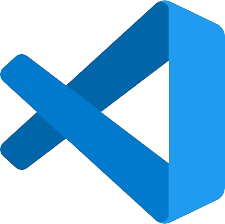

<<<<<<< HEAD
    <h1 style="color:#87CEEB; font-style:italic; font-weight:bold;">
         Instalador e Desinstalador de Extensões do Vscode  </h1>
=======
    <h1 style="color:#87CEEB; font-style:italic; font-weight:bold;"> Instalador e Desinstalador de Extensões do Vscode  </h1>
>>>>>>> ace2ad09981332ff0a283c767998727a8ad08d46

Este repositório contém scripts de linha de comando em batch que facilitam a instalação e a remoção das extensões do Visual Studio Code. Os scripts automatizam o processo de instalação e desinstalação das extensões listadas, economizando tempo e esforço durante a configuração e manutenção do ambiente de desenvolvimento.

### Instalador de Extensões

Este é um script que facilita a instalação das extensões do Visual Studio Code. Ele verifica se as extensões listadas estão instaladas e, se não estiverem, as instala automaticamente.

#### Lista de Extensões

- **Auto Close Tag**: [Auto Close Tag](https://marketplace.visualstudio.com/items?itemName=formulahendry.auto-close-tag)
- **Auto Complete Tag**: [Auto Complete Tag](https://marketplace.visualstudio.com/items?itemName=SEU-ID-DA-EXTENSAO)
- **Auto Rename Tag**: [Auto Rename Tag](https://marketplace.visualstudio.com/items?itemName=formulahendry.auto-rename-tag)
- **Auto Pep 8**:[Auto Pep 8](https://marketplace.visualstudio.com/items?itemName=ms-python.autopep8)
- **Brazilian Portuguese - Code Spell Checker**: [Brazilian Portuguese - Code Spell Checker](https://marketplace.visualstudio.com/items?itemName=streetsidesoftware.code-spell-checker-portuguese-brazilian)
- **Code Spell Checker**: [Code Spell Checker](https://marketplace.visualstudio.com/items?itemName=streetsidesoftware.code-spell-checker)
- **Code Time**: [Code Time](https://marketplace.visualstudio.com/items?itemName=softwaredotcom.swdc-vscode)
- **CodeSnap**: [CodeSnap](https://marketplace.visualstudio.com/items?itemName=adpyke.codesnap)
- **Color Highlight**: [Color Highlight](https://marketplace.visualstudio.com/items?itemName=naumovs.color-highlight)
- **Django**: [Django](https://marketplace.visualstudio.com/items?itemName=batisteo.vscode-django)
- **Docker**: [Docker](https://marketplace.visualstudio.com/items?itemName=ms-azuretools.vscode-docker)
- **EditorConfig for VS Code**: [EditorConfig for VS Code](https://marketplace.visualstudio.com/items?itemName=EditorConfig.EditorConfig)
- **Git History**: [Git History](https://marketplace.visualstudio.com/items?itemName=donjayamanne.githistory)
- **GitHub Copilot**: [GitHub Copilot](https://marketplace.visualstudio.com/items?itemName=GitHub.copilot)
- **GitHub Copilot Chat**: [GitHub Copilot Chat](https://marketplace.visualstudio.com/items?itemName=GitHub.copilot-chat)
- **GitHub Pull Requests**: [GitHub Pull Requests](https://marketplace.visualstudio.com/items?itemName=GitHub.vscode-pull-request-github)
- **GitLens — Git supercharged**: [GitLens — Git supercharged](https://marketplace.visualstudio.com/items?itemName=eamodio.gitlens)
- **HTML CSS Support**: [HTML CSS Support](https://marketplace.visualstudio.com/items?itemName=ecmel.vscode-html-css)
- **indent-rainbow**: [indent-rainbow](https://marketplace.visualstudio.com/items?itemName=oderwat.indent-rainbow)
- **Live Server**: [Live Server](https://marketplace.visualstudio.com/items?itemName=ritwickdey.LiveServer)
- **Markdown All in One**: [Markdown All in One](https://marketplace.visualstudio.com/items?itemName=yzhang.markdown-all-in-one)
- **Material Icon Theme**: [Material Icon Theme](https://marketplace.visualstudio.com/items?itemName=PKief.material-icon-theme)
- **Path Intellisense**: [Path Intellisense](https://marketplace.visualstudio.com/items?itemName=christian-kohler.path-intellisense)
- **Portuguese (Brazil) Language Pack for Visual Studio Code**: [Portuguese (Brazil) Language Pack for Visual Studio Code](https://marketplace.visualstudio.com/items?itemName=MS-CEINTL.vscode-language-pack-pt-BR)
- **Prettier - Code formatter**: [Prettier - Code formatter](https://marketplace.visualstudio.com/items?itemName=esbenp.prettier-vscode)
- **Pylance**: [Pylance](https://marketplace.visualstudio.com/items?itemName=ms-python.vscode-pylance)
- **Python**: [Python](https://marketplace.visualstudio.com/items?itemName=ms-python.python)
- **Python Debugger**: [Python Debugger](https://marketplace.visualstudio.com/items?itemName=ms-python.debugpy)
- **Rainbow CSV**: [Rainbow CSV](https://marketplace.visualstudio.com/items?itemName=mechatroner.rainbow-csv)
- **readme-preview**: [readme-preview](https://marketplace.visualstudio.com/items?itemName=manishsencha.readme-preview)
- **Reaload**: [Reaload](https://marketplace.visualstudio.com/items?itemName=qwtel.sqlite-viewer)
- **SQLite Viewer**: [SQLite Viewer](https://marketplace.visualstudio.com/items?itemName=qwtel.sqlite-viewer)

#### Como Usar o Instalador de Extensões

1. Baixe o arquivo `uninstall_extensions.bat` ou `unistall_extensions.sh` deste repositório.
2. Execute o arquivo baixado clicando duas vezes sobre ele.
3. Aguarde até que todas as extensões sejam verificadas e instaladas.
4. Após a conclusão, você verá a mensagem "Todas as extensões foram verificadas e instaladas.".

### Desinstalador de Extensões

Este é um script que facilita a remoção de todas as extensões instaladas no Visual Studio Code. Ele obtém a lista de extensões instaladas e remove cada uma delas automaticamente.

#### Como Usar o Desinstalador de Extensões

1. Baixe o arquivo `uninstall_extensions.bat` ou `unistall_extensions.sh` deste repositório.
2. Execute o arquivo baixado clicando duas vezes sobre ele.
3. Aguarde até que todas as extensões sejam removidas.
4. Após a conclusão, você verá a mensagem "Todas as extensões foram removidas.".

### Observações

- **Importante**: Certifique-se de ter o Visual Studio Code instalado em seu sistema antes de executar os scripts.
- **Backup**: Antes de executar os scripts, recomendamos fazer backup das extensões importantes.
- **Atenção**: Arquivos .bat são para sistema Window e .sh são para Linux e MacOS

### Compativeis com os sistemas
<table>
  <tr>
    <td align="center">
      
      
Windows

    </td>
    <td align="center">
      
      
Linux

    </td>
    <td align="center">
      
      
MacOS

    </td>
  </tr>
</table>

### Exemplos de Uso

Aqui estão alguns exemplos de como usar os scripts:

- Para instalar as extensões, execute o arquivo `install_extensions.bat`.
- Para desinstalar as extensões, execute o arquivo `uninstall_extensions.bat`.
- Para instalar as extensões, execute o arquivo `install_extensions.sh`.
- Para desinstalar as extensões, execute o arquivo `uninstall_extensions.sh`.

### Contribuição

Contribuições são bem-vindas! Se você encontrou um bug ou tem uma ideia para uma melhoria, fique à vontade para abrir uma issue ou enviar um pull request.

### Licença

Este projeto está licenciado sob a [MIT License](LICENSE).
